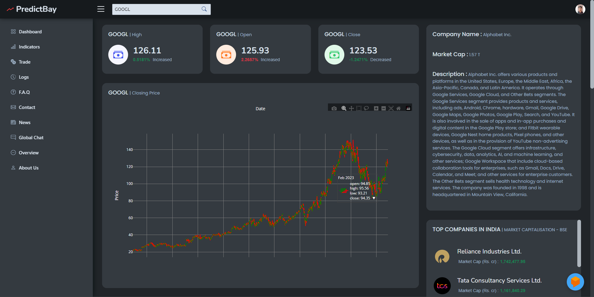
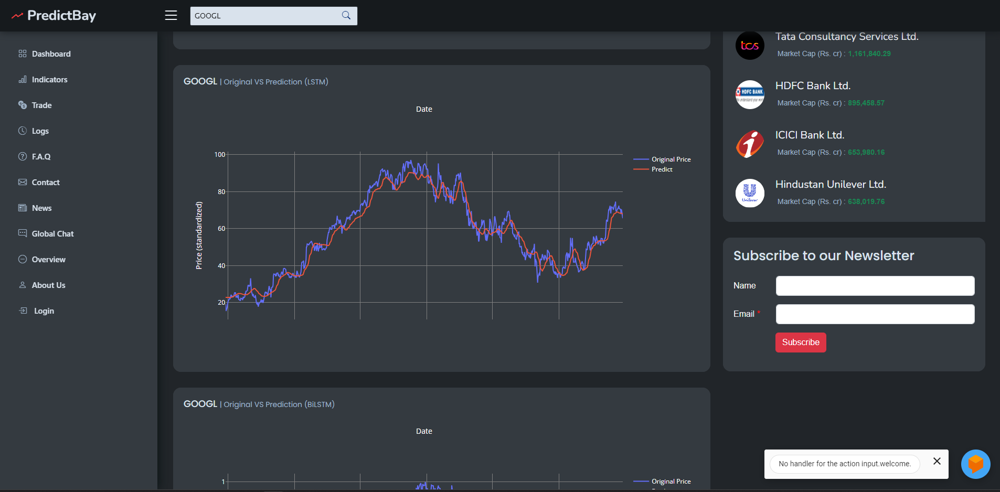
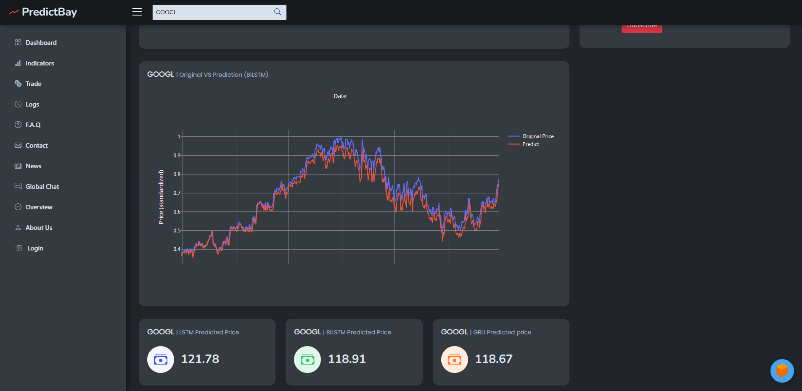
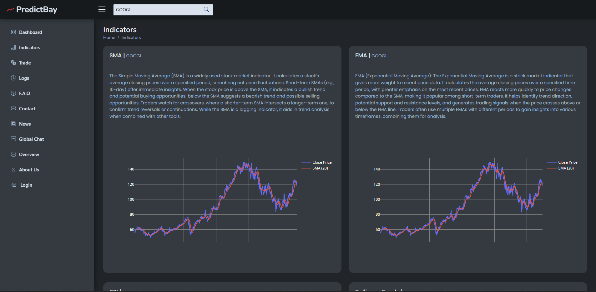
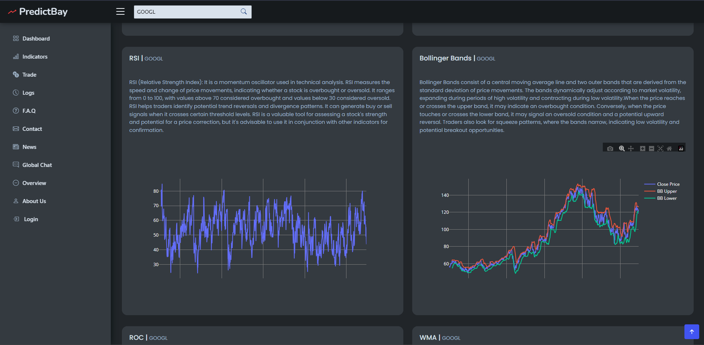

<h1 align="center">Predictbay</h1>
<h5 align="center">"Master the Art of Stock Forecasting: Harness the Power of Machine Learning"</h5>

# Project Overview

The project aims to provide stock price predictions for a given ticker symbol using historical stock data. The web application allows users to input a ticker symbol, and it retrieves the corresponding stock data using the Yahoo Finance API. The application then utilizes two models to predict future stock prices: a traditional machine learning model and a bi-directional LSTM model. The predicted prices are displayed on a web page along with historical price charts and other stock information.

# Web Application

The Flask web application provides a user interface for interacting with the stock prediction models. It uses HTML templates to render the web pages and accepts user inputs for the ticker symbol. It retrieves stock data using the Yahoo Finance API and displays the historical price chart, including moving averages. It also displays the predicted prices from both models, along with other stock information such as the today's high, close, and open values. The application provides additional pages for FAQs, contact information, about section, user registration, and news. It also includes a global chat feature and a login page. Overall, the project combines traditional machine learning techniques with deep learning (LSTM) to predict stock prices. The Flask web application serves as a user-friendly interface to interact with the models and view the predictions, historical data, and other stock-related information.

# Machine Learning Model

The traditional machine learning model used in the project is a regression model trained on historical stock price data. The model is loaded and the data is preprocessesd by scaling it using MinMaxScaler and splitting it into training and testing sets. The model is trained on the training set and used to predict prices on the testing set. The predicted prices are then inverse-transformed using the scaler to obtain the actual predicted values.

# Bi-directional LSTM Model

The bi-directional LSTM model is implemented using the Keras library.The Data_fetch_transform function is responsible for fetching the stock data, preprocessing it, and splitting it into training and testing sets. The model is trained on the training set using the LSTM architecture with a time step of 100. The training and testing sets are reshaped to fit the model's input shape. The model is used to predict prices on the testing set, which are then inverse-transformed using the scaler. Additionally, the code includes an evaluate_predictions function that calculates the difference and ratio between the predicted and actual prices and identifies outliers based on a given threshold. The model also predicts the next day's closing price.

# Predictbay Features

